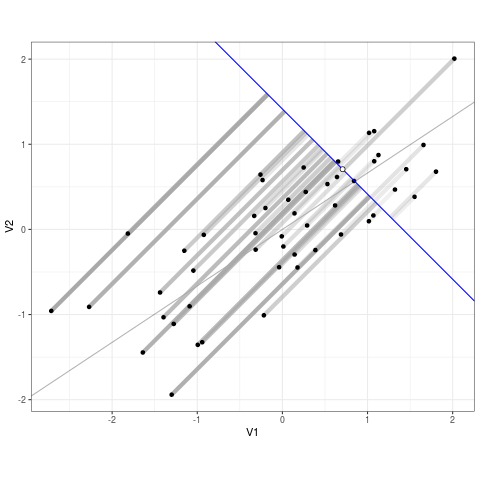

```{r setup, include=FALSE}
knitr::opts_chunk$set(echo = FALSE)
```

## What is linear regression?

-   A statistical model for the relationship between a dependent
    variable $Y$ and one or more predictors

-   What we'll cover:

    -   Some basic mathematical theory and assumptions
    -   Estimation and hypothesis testing of parameters
    -   Interpretation of a linear regression model
    -   Implementation of linear regression in R

-   These slides and all code/data are available online:
    [github.com/bhattacharya-a-bt/qcbio_trial](https://github.com/bhattacharya-a-bt/qcbio_trial).

## The linear regression model

Simple linear regression for a $n$-sample dependent variable $Y$:

$$E[Y] = \beta_0 + \beta_1X + \epsilon$$

Multiple linear regression:

$$E[Y] = \beta_0 + \beta_1X_1 + \beta_2X_2 + \ldots \beta_kX_k + \epsilon$$

-   If we keep $X_2,\ldots,X_k$ constant, $E[Y]$ is still a linear
    (straight-line) function of $X_1$!

## A few specifications and definitions

Linear regression model:

$$E[Y] = \beta_0 + \beta_1X + \epsilon$$

-   This $\epsilon$ parameter represents **random error**, or the
    portion of $Y$ that can't be explained by $X$.

-   We will refer to **estimates** of $\beta_0$ and $\beta_1$ as
    $\hat{\beta}_0$ and $\hat{\beta}_1$

-   The **fitted values** $\hat{Y}$ are our estimates of $Y$ when we
    plug in $\hat{\beta}_0$ and $\hat{\beta}_1$ to the model:
    $\hat{Y} = \hat{\beta}_0 + \hat{\beta}_1X$.

-   The **residuals** $\hat{\epsilon}$ are the differences between the
    observed values of $Y$ and the fitted values:
    $\hat{\epsilon} = Y - \hat{Y}$.

## Ordinary least squares

For our simple linear regression model:

$$E[Y] = \beta_0 + \beta_1X + \epsilon,$$

we estimate $\beta_0$ and $\beta_1$ by finding $\hat{\beta}_0$ and
$\hat{\beta}_1$ that minimizes the **sum of squared residuals**:

$$\sum_{i=1}^n{(y_i - \hat{y}_i)^2} = \sum_{i=1}^n{(y_i - \hat{\beta}_0 - \hat{\beta}_1x_i)^2}.$$

## Visualizing least squares



## Key assumptions for linear regression

It's good practice to check these assumptions when running regressions.

1.  **Linearity**: The relationship between $X$ and the expectation of
    $Y$ is linear.

2.  **Homoscedasticity**: The variance of the residual is the same for
    any value of $X$.

3.  **Independence**: Observations are independent of each other.

4.  **Normality**: For any fixed value of $X$, $Y$ is normally
    distributed.

## Example: eQTL analysis

An expression quantitative trait locus (eQTL) is a genomic locus
associated with expression of a gene.

Traditionally, a preliminary eQTL analysis is a series of linear
regressions between all genetic variants (SNPs) in the genome with all
genes in the transcriptome.

Here, we'll be looking through a single eQTL: 1 SNP, 1 gene, and the
potential influence of age on the SNP-gene relationship.
